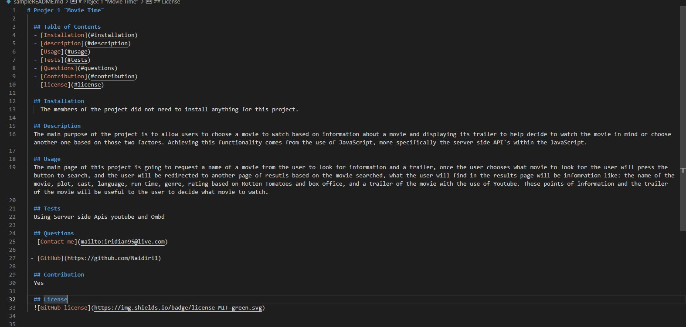

# Professional README Generator #

table of contents
  - [About the project](#abouttheproject)
  - [Installation](#installation)
  - [description](#description)
  - [Usage](#usage)
  - [Credits](#credits)
  - [license](#license)

## About the project 

The main purpose of the project is to create a high quality Readme generator when we create an open source project on GitHub, this Readme generator app includes what the app is for, how to use it, how to install it, how to report issues and how to make contributions. The user can create a Readme by using the command line app to create one, this app helps the user to save some time creating one by his own and this app guides him by answering the questions and giving it details about the project he is creating to finally have a result of a complete Readme just by using the command line and it wil be created for him on those questions answered. 

## Installation 

In order to be able to use this Readme generator, the user needs to install a package.json by using in the command line `npm init` then the user will install the inquirer by using `npm i inquirer@8.2.4` in the command line and the `node modules` will be installed too, with the `package-lockjson.` 

## Description 

This project is for everyone who is interested in using an app based on the command line to create a Readme with questions related to his projects and the app will create a readme based on the inputs provided, the user will save time making one by his own and it will guide the user based on specific questions in order to have a high quality Readme file.

## Usage 

The main reason of this app is to guide the user with specific questions to generate a Readme file, the user will have to open the command line and open the index.js using `node index.js` and there will be questions to guide the user: What is the name of your file?, What is the title of your project?, What is the description of your project?, How did you install your project?, How to use your project?, Do you want users to contribute to your project?, What test have you run in your application?, Enter your email so If other want to contact the user they will be redirect to open their email and send an email to the user, Enter your GitHub,if so the user will provide his username from Github and it will create a link to acces his repository, Choose a license for your project. Once everything  is answer automatically there will be a `Readme.md` created with the inputs of the user.

- [Video of the app generating a sample of Readme file](https://app.castify.com/view/6b145d32-5259-4286-9a4c-216edfe5d4c1)

[sample of the Readme Generator](./sampleREADME.md)

## Credits 

N/A

## License 
N/A